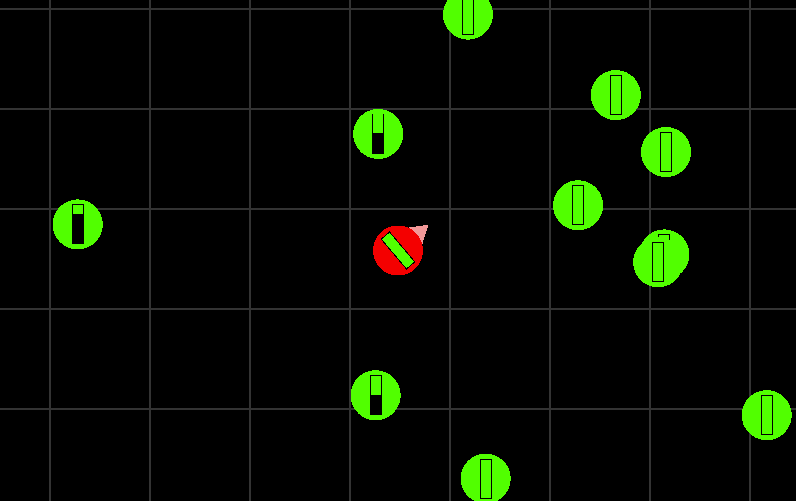

# nengi-2d-basic
This is a game template demonstrating the networking of a 2D shooter with out any client-side prediction or lag compensation. Culling is enabled, and you can modify the client view size on the server to make the effects of culling more obvious.

To run the game:
```sh
npm install
npm start
## visit http://localhost:8080
```
The game should look like this:


The renderer is PIXI v5, though the game doesn't do pixi any justice.

The controls are
- w - up
- a - left
- s - down
- d - right
- mousemove - look around
- mouseclick - shoot

Players and green circles have 100 hp, and shots do 25 damage. After reaching 0 hp players and green circles will respawn 1 second later.

## Bots
There are bots programmed to run around randomly in the game. To connect the bots keep the game running as done with `npm start` and then open an additional command prompt.
```sh
> node bot/index.js
```
